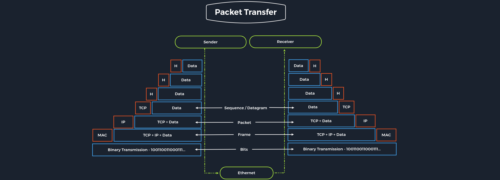

# Networking



## General

- Topologies  - mesh/tree/star
- Mediums - ethernet/fiber/coax/wireless
- Protocols - TCP/UDP/IPX
- URL/FQDN
    - FQDN - www.abc.com
    - URL -  [www.abc.com](http://www.abc.com)/example?floor=256

## Network Types

- WAN - internet
    - the primary way we identify if the network is a WAN is to use a WAN Specific routing protocol such as BGP and if the IP Schema in use is not within RFC 1918 (10.0.0.0/8, 172.16.0.0/12, 192.168.0.0/16).
- LAN
- WLAN
- VPN
    - S2S VPM
    - Remote Access VPN
    - Split-Tunnel VPN  - Internet connection is not going out of the VPN
    - SSL VPN - browser based VPN
- A wireless personal area network that is established via Bluetooth is called Piconet

## Networking Topologies

- Physical Topology
- Logical Topology
- Three areas
    - Connections
    - Nodes - Network Interface Controller (NIC)
    - Classifications
        - Point to point
        - Star
        - Mesh
        - Hybrid
        - Bus
        - Ring
        - Tree
        - Daisy Chain
            - a-b-c ; automation technology (CAN)
        - 

## Proxies

- A proxy is when a device or service sits in the middle of a connection and acts as a mediator
- Mediator - able to inspect the contents of traffic , otherwise device is gateway
- Mostly operate at Layer 7
- Dedicated Proxy / Forward Proxy
    - A Forward Proxy is when a client makes a request to a computer, and that computer carries out the request.
    - Web Browsers like Internet Explorer, Edge, or Chrome all obey the "System Proxy" settings by default. If the malware utilizes WinSock (Native Windows API), it will likely be proxy aware without any additional code.
    - Firefox does not use WinSock and instead uses libcurl, which enables it to use the same code on any operating system. This means that the malware would need to look for Firefox and pull the proxy settings, which malware is highly unlikely to do.
    - What is C2 mechanism in malware?
    - Example - Burp Suite
- Reverse Proxy
    - Filters incoming requests
    - The most common goal with a Reverse Proxy, is to listen on an address and forward it to a closed-off network.
    - The infected endpoint will listen on a port and send any client that connects to the port back to the attacker through the infected endpoint. This is useful to bypass firewalls or evade logging. Organizations may have IDS (Intrusion Detection Systems), watching external web requests. If the attacker gains access to the organization over SSH, a reverse proxy can send web requests through the SSH Tunnel and evade the IDS.
    - Another common Reverse Proxy is ModSecurity, a Web Application Firewall (WAF)
- (Non-) Transparent Proxy
    - With a transparent proxy, the client doesn't know about its existence

## Networking models


- OSI Model
- TCP/IP  Model
    - IP Layer 3 -The Internet Layer is responsible for host addressing, packaging, and routing functions.
    - TCP Layer 4  - The Transport Layer is responsible for providing (TCP) session and (UDP) datagram services for the Application Layer.
    - Important aspects of TCP/IP
    
    | Task | Protocol | Description |
    | --- | --- | --- |
    | Logical Addressing  | IP | Network classes, subnetting and CIDR |
    | Routing | IP |  |
    | Error & control flow | TCP | control messages are sent continuously to check if the connection is still established. |
    | Application support | TCP | TCP and UDP ports form a software abstraction to distinguish specific applications and their communication links. |
    | Name Resolution |  |  |
- Packet Transfers
    - In a layered system, devices in a layer exchange data in a different format called a protocol data unit (PDU)
    - During the transmission, each layer adds a header to the PDU from the upper layer, which controls and identifies the packet. This process is called encapsulation


## Network Layer

- Layer 3
- Controls the exchange of data packets
- Responsible for
    - Logical Addressing
    - Routing
- Protocols on this layer
    - IPv4 / IPv6, IPsec, ICMP, IGMP, RIP, OSPF

## IP Addresses

- Host - Media Access Control (MAC) Address
    - If MAC communicate within network possible , not ouside
- IPv4 structure
    - 32-bit = 4 bytes of 8-bit groups
    - IP = host + network
    - Subnet mask
    - Network and broadcast addresses
    - Default gateway - router
- Broadcast Address
    - The broadcast IP address's task is to connect all devices in a network with each other.
    - Broadcast in a network is a message that is transmitted to all participants of a network and does not require any response.
    - last IPv4 address that is used for the broadcast
- CIDR
    - Classless Inter-Domain Routing (CIDR)

## Subnetting

- The division of an address range of IPv4 addresses into several smaller address ranges is called subnetting.
- The bits in the host part can be changed to the first and last address. The first address is the network address, and the last address is the broadcast address for the respective subnet.
- So if we now set all bits to 0 in the host part of the IPv4 address, we get the respective subnet's network address.
- If we set all bits in the host part of the IPv4 address to 1, we get the broadcast address.

## MAC Addresses

- 48-bit - 6 octets
- Hexadecimal format
- Physical address of our network interfaces
- Standards
    - Ethernet (IEEE 802.3)
    - Bluetooth (IEEE 802.15)
    - WLAN (IEEE 802.11)
- When an IP packet is delivered, it must be addressed on layer 2 to the destination host's physical address or to the router / NAT, which is responsible for rout
- First 3 bytes - Organisation Unique Identifier (OUI)
- Last half - Individual Address Part or Network Interface Controller (NIC)
- Address Resolution Protocol (ARP) is used in IPv4 to determine the MAC addresses associated with the IP addresses.
- First octet - The last bit identifies the MAC address as Unicast (0) or Multicast (1)
- Broadcast - ARP DHCP
- The second last bit in the first octet identifies whether it is a global OUI, defined by the IEEE, or a locally administrated MAC address.
- Attacks related to MAC addresses
    - MAC spoofing: This involves altering the MAC address of a device to match that of another device, typically to gain unauthorized access to a network.
    - MAC flooding: This involves sending many packets with different MAC addresses to a network switch, causing it to reach its MAC address table capacity and effectively preventing it from functioning correctly.
    - MAC address filtering: Some networks may be configured only to allow access to devices with specific MAC addresses that we could potentially exploit by attempting to gain access to the network using a spoofed MAC address.

## Address Resolution Protocol

- Resolve a network layer 3 IP address to a link layer 2 MAC address
- When a device on a LAN wants to communicate with another device, it sends a broadcast message containing the destination IP address and its own MAC address. Response with its own MAC address . Thus communication is established using MAC address no need for IP
- Requests
    - ARP Request
    - ARP Reply
- Tshark capture of ARP Request

```powershell
1   0.000000 10.129.12.100 -> 10.129.12.255 ARP 60  Who has 10.129.12.101?  Tell 10.129.12.100
2   0.000015 10.129.12.101 -> 10.129.12.100 ARP 60  10.129.12.101 is at AA:AA:AA:AA:AA:AA

3   0.000030 10.129.12.102 -> 10.129.12.255 ARP 60  Who has 10.129.12.103?  Tell 10.129.12.102
4   0.000045 10.129.12.103 -> 10.129.12.102 ARP 60  10.129.12.103 is at BB:BB:BB:BB:BB:BB
```

- ARP spoofing, also known as ARP cache poisoning or ARP poison routing, is an attack that can be done using tools like Ettercap or Cain & Abel in which we send falsified ARP messages over a LAN.
- The goal is to associate our MAC address with the IP address of a legitimate device on the company's network, effectively allowing us to intercept traffic intended for the legitimate device. For example, this could look like the following

## IPv6

- 128 bit - 16 bytes - 8 blocks
- End-to-end principle , no need for NAT
- Advantages
    - Larger address space
    - Address self-configuration (SLAAC)
    - Multiple IPv6 addresses per interface
    - Faster routing
    - End-to-end encryption (IPsec)
    - Data packages up to 4 GByte

## Protocols

- TCP - connection oriented - reliable -slower than UDP
- UDP - connectionless - faster than TCP
- ICMP
    - Internet Control Message Protocol
    - Communicate , error reporting and status information
    - ICMP request and reply , error messages, destination unreachable and time exceeded
    - Time-to-live (TTL) field in ICMP packet header limits the packet's lifetime as it travels through the network
    - We can also use TTL to determine the number of hops a packet has taken and the approximate distance to the destination. For example, if a packet has a TTL of 10 and takes 5 hops to reach its destination, it can be inferred that the destination is approximately 5 hops away. For example, if we see a ping with the TTL value of 122, it could mean that we are dealing with a Windows system (TTL 128 by default) that is 6 hops away.
    - For example: Windows systems (2000/XP/2003/Vista/10) typically have a default TTL value of 128, while macOS and Linux systems typically have a default TTL value of 64 and Solaris' default TTL value of 255.
- VOIP
    - The most common VoIP ports are TCP/5060 and TCP/5061, which are used for the Session Initiation Protocol (SIP). However, the port TCP/1720 may also be used by some VoIP systems for the H.323 protocol, a set of standards for multimedia communication over packet-based networks. Still, SIP is more widely used than H.323 in VoIP systems.
    - One of the possible ways to enumerate users is the SIP OPTIONS request - Requests information about the capabilities of a SIP server or user agent, such as the types of media it supports.

## Wireless Networks

- Communication between devices occurs over RF in the 2.4 GHz or 5 GHz bands in a WiFi network.
- When a device, like a laptop, wants to send data over the network, it first communicates with the Wireless Access Point (WAP) to request permission to transmit.
- WiFi Connection
    - The device must also be configured with the correct network settings, such as the network name / Service Set Identifier (SSID) and password.
    - the SSID can be hidden by disabling broadcasting
- WEP Challenge-Response Handshake
- The design of the CRC mechanism has a flaw that allows us to decrypt a single packet without knowing the encryption key. This is because the CRC value is calculated using the plaintext data in the packet rather than the encrypted data. In WEP, the CRC value is included in the packet header along with the encrypted data. When the destination device receives the packet, the CRC value is recalculated and compared to the original one to ensure that the data has been transmitted successfully without any errors. However, we can use the CRC to determine the plaintext data in the packet, even if the data is encrypted.
- A Disassociation Attack is a type of all wireless network attack that aims to disrupt the communication between a WAP and its clients by sending disassociation frames to one or more clients.
- Wireless Hardening
    - Disabling broadcasting
    - WiFi Protected Access
    - MAC filtering
    - Deploying EAP-TLS

## VPN

- VPN typically uses the ports TCP/1723 for Point-to-Point Tunneling Protocol PPTP VPN connections and UDP/500 for IKEv1 and IKEv2 VPN connections.
- At the TCP/IP layer, a VPN connection typically uses the Encapsulating Security Payload (ESP) protocol to encrypt and authenticate the VPN traffic.
- IPsec
    - Internet Protocol Security
    - works by encrypting the data payload of each IP packet and adding an authentication header (AH),.
    - AH + ESP
    - Keys negotiated using IKE Internet Key Exchange
- PPTP
    - Point-to-point Tunneling Protocol
    - vulnerable

## VLAN

- A VLAN is a logical grouping of network endpoints connected to defined ports on a switch, allowing the segmentation of networks by creating logical broadcast domains that can span multiple physical LAN segments
- Cisco switches provide the VLAN IDs/numbers 1-4094 (0 and 4095 are reserved IDs and cannot be used); IDs 1-1005 (VLAN 1 is known as the default VLAN and cannot/should not be altered nor deleted) are known as normal-range VLANs, with IDs 1002-1005 being reserved for Token Ring and Fiber Distributed Data Interface (FDDI) VLANs, while IDs 1006-4094 are known as extended-range VLANs. By default, any customization applied for normal-range VLANs is saved in the VLAN database (the vland.dat file), in contrast to extended-range VLANs, which do not have their customizations saved. VLANs 2-1001 stored in vlan.dat can have parameters including name, type, state, and maximum transmission unit (MTU).
- Analyzing VLAN Tagged Traffic
    - vlan filter 802.1Q tagging

## Key Exchange Mechanisms

- Diffie-Hellman key exchange
    - TLS
    - Vulnerable to MITM
- RSA
- ECDH - Elliptic curve Diffie-Hellman
- Elliptic Curve Digital Signature Algorithm (ECDSA)
- Internet Key Exchange
    - Main mode - considered more secure than the aggressive mode
    - Aggressive mode - faster performance
    - In IKE, a Pre-Shared Key (PSK) is a secret value shared between the two parties involved in the key exchange.
- The Record-Route field in the IP header also records the route to a destination device

```powershell
ping -c 1 -R 10.129.143.158
```

- Tool - traceroute
    - TCP SYN - TTL of 1
    - TTL 1 reached router - it sends ICMP Time-Exceeded Packet
    - Note ip of router
    - increase TTL by 1
    - When traceroute is used with UDP, we will receive a Destination Unreachable and Port Unreachable message when the UDP datagram packet reaches the target device
- Blind spoofing, is a method of data manipulation attack in which an attacker sends false information on a network without seeing the actual responses sent back by the target devices.

## Cryptography

- Symmetric - AES and DES
- Asymmetric Encryption - public-key encryption - encrypt-decrypot , RSA PGP (Pretty Good Privacy) ECC
- A cipher mode refers to how a block cipher algorithm encrypts a plaintext message.
