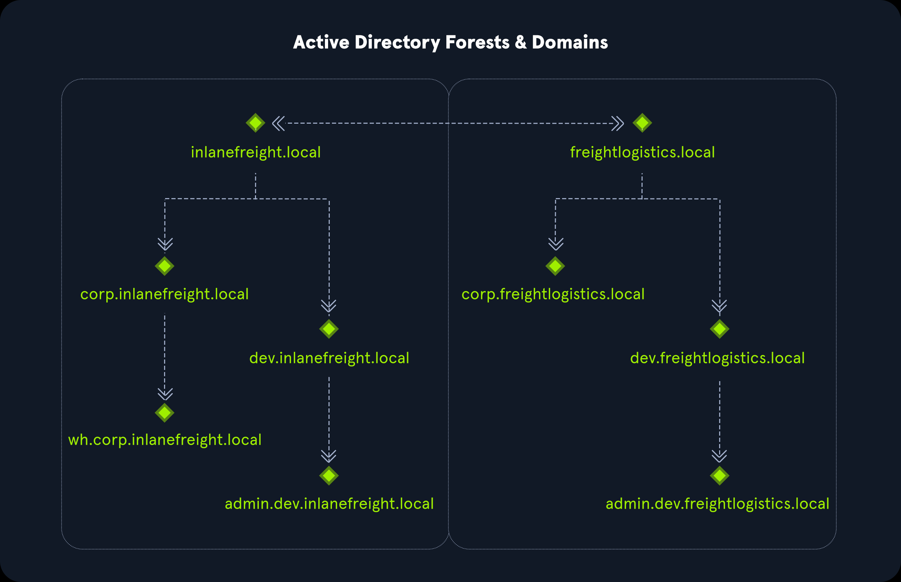

# 05_Active_Directory

## General

- Directory service, distributed, hierarchical , centralized management
- AD provides authentication and authorization functions within a Windows domain environment
- Backward compatible
- sizeable read-only database accessible to all users within the domain, regardless of their privilege level.
- A basic AD user account with no added privileges can enumerate most objects within AD
- noPac attack
- Conti Ransomware
- PrintNightmare Zerologon - CVE

## History

- LDAP -Lightweight Directory Access Protocol
- Kerberos?
- Active Directory Federation Services ADFS - uses the claims-based Access Control Authorization model
- Group Managed Service Accounts (gMSA) - recommended mitigation against the infamous Kerberoasting attack

## AD Structure

- A basic AD user can enumerate
    - Domain Computers; Domain Users; Domain Group Information; Organizational Units (OUs); Default Domain Policy; Functional Domain Levels; Password Policy; Group Policy Objects (GPOs); Domain Trusts; Access Control Lists (ACLs)
- Tree structure
    - Forest - security boundary within which all objects are under administrative control
    - Domain - contained objects (users,computers and groups)
        - Organizational Units (OUs) - Domain controllers, Users, Computers
    - Sub-domains
- Multiple domains/forests are linked together via trust relationships
- Trust between - INLANEFREIGHT.LOCAL and FREIGHTLOGISTICS.LOCAL
    - child domains in forest A do not necessarily have trusts established with the child domains in forest B
    - To allow direct communication from admin.dev.freightlogistics.local and wh.corp.inlanefreight.local, another trust would need to be set up.

## AD Terminologies

- Object - any resource in AD
- Attributes - associated with objects
    - All attributes in AD have an associated LDAP name
- Schema - blueprint of any enterprise environment, defines what type of objects can exist
    - When an object is created from a class, this is called instantiation, and an object created from a specific class is called an instance of that class.
    - For example, if we take the computer RDS01. This computer object is an instance of the "computer" class in Active Directory.
- Domain - logical grouping of objects (independent or trust relationships)
- Forest - collection of AD domains; topmost container
- Tree - collection of AD domains that begins at a single root domain; forest is collection of AD tress
- Container - Container objects hold other objects and have a defined place in the directory subtree hierarchy
- Leaf
- Global Unique Identifier (GUID) - 128 bit value assigned when a domain user or group is created
    - every object GUID
    - store in `objectGUID` attribute
    - never changes
- Security principals - authentication ; domain objects that can manage access to other resources within the domain
    - We can also have local user accounts and security groups used to control access to resources on only that specific computer. These are not managed by AD but rather by the Security Accounts Manager (SAM).
- Security Identifier (SID) - unique identifier for a security principal or security group
    - issued by the domain controller
    - A SID can only be used once, even if security principle is deleted, it can never be used again in that environment to identify another user or group.
- Distinguished Name (DN) - describes the full path to an object in AD
- Relative DN
- sAMAccountName - user’s logon name
- userPrincipalName
- FSMO Roles - Flexible Singel Master Operation (FSMO) roles
    - Schema Master
    - Domain Naming Master (one per forest)
    - Relative ID (RID) Master (one per domain)
    - Primary Domain Controller (PDC) Emulator (one per domain)
    - Infrastructure Master (one per domain)
- Global catalog (GC)
    - domain controller that store copies of ALL object in AD forest
- Read-Only Domain Controller (RODC)
- Replication - happens in AD when AD objects are updated and transferred from one Domain Controller to another
- Service Principal Name (SPN) - used by Keberos authentication
