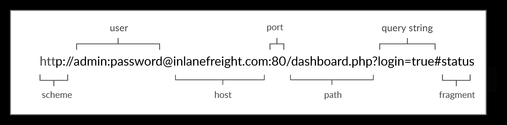

# 06-web-requests

## HyperText Transfer Protocol (HTTP)

- The term hypertext stands for text containing links to other resources and text that the readers can easily interpret.
- Default port
    - HTTP - 80
- We enter a Fully Qualified Domain Name (FQDN) as a Uniform Resource Locator (URL) to reach the desired website
- URL

- if no path is specified, the server returns the default index (e.g. index.html)
- Queries separated by `&`
- Fragments are processed by the browsers on the client-side to locate sections within the primary resource

- `/etc/hosts` - browser checks this first, we can manually add records to DNS resolution
- browser asks for root / path , servers return index when request for / is received

## HTTPS

- Note: Although the data transferred through the HTTPS protocol may be encrypted, the request may still reveal the visited URL if it contacted a clear-text DNS server. For this reason, it is recommended to utilize encrypted DNS servers (e.g. 8.8.8.8 or 1.1.1.1), or utilize a VPN service to ensure all traffic is properly encrypted.

## cURL

- cURL - client URL
- skip certificate check flag `-k`

## HTTP Request

- The headers are terminated with a new line, which is necessary for the server to validate the request.
- HTTP version 1.X sends requests as clear-text, and uses a new-line character to separate different fields and different requests. HTTP version 2.X, on the other hand, sends requests as binary data in a dictionary form.

## HTTP Response

### Browser DevTools

- ****CTRL+SHIFT+I  F12****

## HTTP Headers

- Types
    - General Headers
        - both request and response
        - describe message rather than its contents
        - Dare , Connection (close , keep-alive)
    - Entity Headers
        - common to both the request and response
        - describe the content
        - usually found in responses and POST or PUT requests.
        - Content-type , media-type, boundary, content-length, content-encoding
    - Request Headers
        - Host, user-agent, referer ( clicking from google would make google referer), accept (*/* all media types are accepted) , cookie (name=value) , authorization
    - Response Headers
        - Server, Set-Cookie, WWW-Authenticate
    - Security Headers
        - HTTP Security headers are a class of response headers used to specify certain rules and policies to be followed by the browser while accessing the website
        - Content-Security-Policy,
            - Dictates the website's policy towards externally injected resources. This could be JavaScript code as well as script resources. This header instructs the browser to accept resources only from certain trusted domains, hence preventing attacks such as Cross-site scripting (XSS).
        - Strict-Transport-Security - forces communication to be carried over HTTPS
        - Referrer-Policy

## HTTP Methods and Codes

| Method  | Description |
| --- | --- |
| GET | Requests a specific resource. Additional data can be passed to the server via query strings in the URL (e.g. ?param=value). |
| POST | Sends data to the server. It can handle multiple types of input, such as text, PDFs, and other forms of binary data. This data is appended in the request body present after the headers. The POST method is commonly used when sending information (e.g. forms/logins) or uploading data to a website, such as images or documents. |
| HEAD | Requests the headers that would be returned if a GET request was made to the server. It doesn't return the request body and is usually made to check the response length before downloading resources |
| PUT | Creates new resources on the server. Allowing this method without proper controls can lead to uploading malicious resources. |
| DELETE | Deletes an existing resource on the webserver. If not properly secured, can lead to Denial of Service (DoS) by deleting critical files on the web server. |
| OPTIONS | Returns information about the server, such as the methods accepted by it. |
| PATCH | Applies partial modifications to the resource at the specified location. |

| Type | Description |
| --- | --- |
| 1xx | Provides information and does not affect the processing of the request. |
| 2xx | Returned when a request succeeds. |
| 3xx | Returned when the server redirects the client. |
| 4xx | Signifies improper requests from the client. For example, requesting a resource that doesn't exist or requesting a bad format. |
| 5xx | Returned when there is some problem with the HTTP server itself. |
- 200 OK
- 302 Found
- 400 Bad Request
- 403 Forbidden
- 404 Not Found
- 500 Internal Server Error

- Unlike HTTP GET, which places user parameters within the URL, HTTP POST places user parameters within the HTTP Request body
- 

## CRUD API

- In general, APIs perform 4 main operations on the requested database entity:

| Operation | HTTP Method | Description |
| --- | --- | --- |
| Create | POST | Adds the specified data to the database table |
| Read | GET | Reads the specified entity from the database table |
| Update | PUT | Updates the data of the specified database table |
| Delete | DELETE | Removes the specified row from the database table |
- The HTTP PATCH method may also be used to update API entries instead of PUT. To be precise, PATCH is used to partially update an entry (only modify some of its data "e.g. only city_name"), while PUT is used to update the entire entry. We may also use the HTTP OPTIONS method to see which of the two is accepted by the server, and then use the appropriate method accordingly. In this section, we will be focusing on the PUT method, though their usage is quite similar.94.237.56.188:40362
-