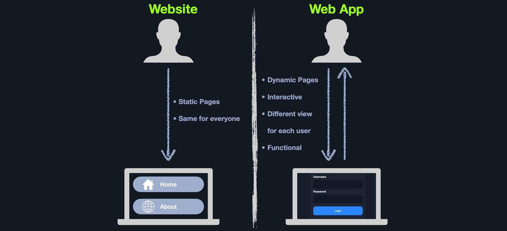

# 07-web-applications

## General

## Web Application Layout

- Web Application Infrastructure models
    - Client-Server
    - One Server
    - Many Servers - One Database
    - Many Servers - Many Databases
- Web Application Components
    - UI/UX, Client, and Server\
- Web Application Architecture
    - Three Tier Architecture
        - Presentation Layer
        - Application Layer
        - Data Layer

## Microservices

- Communication between these microservices is stateless - request and response are independent as data is stored separately
- use micro - is considered service-oriented architecture SOA
- [https://docs.aws.amazon.com/pdfs/whitepapers/latest/microservices-on-aws/microservices-on-aws.pdf](https://docs.aws.amazon.com/pdfs/whitepapers/latest/microservices-on-aws/microservices-on-aws.pdf)

## Front end

- HTML, CSS, and JavaScript

## Back end

- The back end of a web application drives all of the core web application functionalities
- Back end server, web servers, databases, development frameworks

## URL Encoding

- space %20

## Misconfigs

- Sensitive Data Exposure refers to the availability of sensitive data in clear-text to the end-user
- `ctrl + u`
- HTML Injection